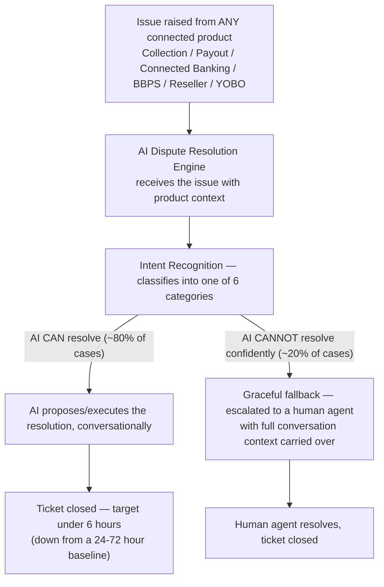

# 🤖 AI Dispute Resolution Engine

**An AI Operations Copilot for the platform — dispute resolution is its most mature, most rigorously validated capability, not the whole product.**

> This repository documents the QA strategy, test automation, and testing approach applied to an
> **AI operating layer** that sits across the platform — reading (with permission) Connected
> Banking, Collection, Payout, Disputes, Settlements, Reports, Commercials, KYC, Transactions,
> Audit Logs, User Roles, and Analytics data to understand, correlate, explain, recommend, and in
> some cases act. The **shared dispute/support layer across six connected products** — Collection,
> Payout, Connected Banking, BBPS, Reseller, and YOBO — is the slice of this Copilot documented in
> the most depth here, because it's the slice with the deepest test coverage. Whatever goes wrong
> in any of those six products — a stuck transaction, an account-detail change, a reseller's
> commission question — this engine is the **one final destination** for resolving it.
>
> See [`docs/business-overview.md`](./docs/business-overview.md) section 1 for the full "what
> this product actually is" breakdown — including the tiered model for what the AI does
> autonomously versus only proposes for human confirmation.
>
> All content here uses **generic/sample data only**. No client names, company names, or
> confidential/production information are included. Dates and timelines are placeholders —
> update `[Timeline]` before publishing.
>
> 📍 **New here?** [`docs/README.md`](./docs/README.md) is a documentation map answering "what is
> this, how does it work, who's involved, what does it depend on" — with a recommended reading
> order through every doc in this repo.

---

## 📖 Table of Contents

1. [What is This — and Why One Engine for Six Products?](#-what-is-this--and-why-one-engine-for-six-products)
2. [My Role](#-my-role)
3. [Tech Stack & Tools Used](#-tech-stack--tools-used)
4. [Types of Testing Performed](#-types-of-testing-performed)
5. [How It Works — Dispute Resolution Flow](#-how-it-works--dispute-resolution-flow)
6. [Action Tiers — Answer, Act, or Propose?](#-action-tiers--answer-act-or-propose)
7. [Key Achievements](#-key-achievements)
8. [Automation Approach](#-automation-approach)
9. [Regression Checklist](#-regression-checklist)
10. [Screenshots & Reports](#-screenshots--reports)
11. [Repository Structure](#-repository-structure)

> Deeper dives not covered inline in this README: [Modules, Submodules & Stakeholders](./docs/business-overview.md),
> [Architecture, Flow & Real Sequence Diagrams](./docs/architecture-and-flow.md),
> [Full Tech Stack & Skills Demonstrated](./docs/tech-and-skills.md),
> [Shared Platform Services](./docs/shared-platform-services.md),
> [UI Consistency](./docs/ui-consistency.md) — see [`docs/README.md`](./docs/README.md) for the
> full map. **Every diagram in this repo is drawn in Mermaid and renders natively right here on
> GitHub — nothing requires visiting another site.**

---

## 💡 What is This — and Why One Engine for Six Products?

This product is an **AI Operations Copilot** — an AI operating layer with permissioned access
across the platform's data (Connected Banking, Collection, Payout, Disputes, Settlements,
Reports, Commercials, KYC, Transactions, Audit Logs, User Roles, Analytics) that understands,
correlates, explains, recommends, and — for a defined set of low-risk actions — executes directly.
For anything higher-risk (refunding a dispute, approving a beneficiary, blocking a merchant,
creating a settlement), it proposes the action for a human to confirm rather than acting
unilaterally. Full breakdown: [`docs/business-overview.md`](./docs/business-overview.md) section 1.

Every fintech product in this portfolio — **Collection**, **Payout**, **Connected Banking**,
**BBPS**, **Reseller**, and **YOBO** — generates support issues and disputes: a transaction stuck
in an unclear state, a merchant needing to update their registered email or mobile number, a
question about onboarding status, a reseller questioning a commission figure, or a general "what
does this error mean?" question. This is the slice of the Copilot's capability set documented in
the most depth in this repo, because it's the slice with the most mature, most rigorously tested
coverage.

Instead of each product building and maintaining its **own** dispute/support chatbot, the
platform centralizes this into **one shared AI layer** that all six products route into. This is
a deliberate architectural choice, not an accident:

- **One place to improve the AI model** — every conversation, across every product, makes the
  same shared model better, instead of six separate models each learning slower in isolation
- **One consistent support experience** — a merchant using both Collection and Payout gets the
  same quality of AI support in both, instead of a good experience in one and a poor one in
  another
- **One place to test and harden** — conversational AI QA (intent recognition, fallback
  handling, escalation correctness) is done once, at high rigor, rather than six times at
  variable quality

If you're new to fintech QA, HR, or any non-technical role: think of this as a single, shared
customer-support brain plugged into six different products, rather than six separate,
lower-quality support teams.

### Who typically interacts with it?

| Role | What they do |
|---|---|
| **Merchant / End User** | Raises an issue from within any of the 6 connected products, converses with the AI agent, gets resolved or escalated |
| **Reseller** | Raises Commission/Revenue Dispute queries specifically — see [`docs/business-overview.md`](./docs/business-overview.md) section 5 |
| **Human Support Agent** | Handles the ~20% of cases the AI escalates rather than resolves directly |
| **Platform Admin/Ops** | Monitors AI resolution rates, reviews escalation trends, tunes acceptance criteria for AI-suggested resolutions |

---

## 👤 My Role

QA Engineer / SDET responsible for validating the AI Dispute Resolution Engine across
conversational AI quality, cross-product dispute workflows, and anomaly detection.

- Performed **functional and conversational AI testing** — intent recognition, response
  accuracy, fallback handling, and context retention across dispute management conversations
- Validated **AI-driven dispute flows end-to-end**: automated dispute initiation, AI-suggested
  resolutions, escalation triggers, and real-time status updates
- Tested **anomaly-detection models** by injecting edge-case transaction scenarios to verify
  fraud alerts and threshold-breach behavior
- Conducted **negative/boundary testing on AI responses** to confirm graceful degradation and
  reliable fallback to human agents
- Validated the engine's behavior **consistently across all six connected products**, not just
  one — the same intent (e.g. "update my mobile number") must resolve correctly whether raised
  from Collection, Payout, Connected Banking, BBPS, Reseller, or YOBO
- Collaborated on defining acceptance criteria and validating model outputs against quality
  standards prior to release

**Timeline:** `[Add Duration]`

---

## 🛠 Tech Stack & Tools Used

| Category | Tools |
|---|---|
| **UI Automation** | Playwright, TypeScript |
| **API Testing & Automation** | Playwright API requests, Postman |
| **Performance Testing** | k6 (concurrent-session load, inference latency, escalation-queue backpressure) |
| **CI/CD** | Jenkins / GitHub Actions |
| **Bug Tracking & Traceability** | JIRA, RTM (Requirement Traceability Matrix — see [`sample-rtm.md`](./sample-rtm.md)) |
| **Version Control** | Git, GitHub |

> Full detail on *why* each tool was chosen, a skill → proof map, and the performance testing
> approach in depth: [`docs/tech-and-skills.md`](./docs/tech-and-skills.md).

---

## 🧪 Types of Testing Performed

- **AI Chatbot Testing** — intent recognition, response accuracy, fallback handling, context
  retention
- **Conversational Flow Testing** — multi-turn dialogue correctness across issue categories
- **Dispute Workflow Validation** — initiation, AI-suggested resolutions, escalation, status
  updates
- **AI Anomaly Detection Testing** — edge-case transaction scenarios, fraud alert thresholds
- **Negative & Boundary Testing on AI Responses** — graceful degradation, reliable human-agent
  fallback
- **Cross-Product Consistency Testing** — the same issue category resolves consistently whether
  raised from Collection, Payout, Connected Banking, BBPS, Reseller, or YOBO
- **Action-Tier & Confirmation-Flow Testing** — verifying low-risk actions execute directly while
  high-risk actions (refunds, beneficiary approvals, merchant blocks, settlement creation) always
  stop at a human-confirmation step, never execute unilaterally — see
  [`regression-checklist.md`](./regression-checklist.md) section 10
- **Audit-Trail Verification** — every proposed or executed action is logged with its reasoning,
  regardless of whether a human approved, rejected, or never reviewed it
- **Performance Testing** — concurrent-session load, inference latency, and escalation-queue
  backpressure under a surge of mandatory escalations, validated with k6 (see
  [`docs/tech-and-skills.md`](./docs/tech-and-skills.md) section 5)
- **API Testing** / **Regression Testing**

---

## 🔄 How It Works — Dispute Resolution Flow



**Testing implication:** because this engine is *shared*, a regression here has a **6x blast
radius** compared to a single-product bug — an intent-recognition regression doesn't just affect
one product's support quality, it silently degrades support across all six simultaneously. This
is why cross-product consistency testing (not just per-category correctness) is treated as a
first-class regression category for this repo, not an afterthought. See
[`docs/architecture-and-flow.md`](./docs/architecture-and-flow.md) for the full set of sequence
diagrams, including exactly how an Excessive Agency or Prompt Injection defect actually happens
under the hood.

### Issue Categories Handled

| Category | Example |
|---|---|
| **Transaction Status** | "Why is my collection/payout still processing?", "Is this transaction stuck?" |
| **Email Change** | Merchant requesting to update their registered email address |
| **Mobile Number Change** | Merchant requesting to update their registered mobile number |
| **Merchant Onboarding** | Status questions during signup/KYC/activation |
| **Commission / Revenue Dispute** | Reseller questioning a commission figure or attribution change — see [`docs/business-overview.md`](./docs/business-overview.md) section 5 |
| **General Fintech Q&A** | Broader questions about fees, settlement timing, supported transfer modes, etc. |

---

## ⚖️ Action Tiers — Answer, Act, or Propose?

The Copilot's capabilities (section 1 of [`docs/business-overview.md`](./docs/business-overview.md))
split into three tiers by risk, not by convenience:

| Tier | Example | Behavior |
|---|---|---|
| **Understand & Recommend** (always autonomous) | "Why did my settlement decrease?", "Summarise today's business" | AI answers directly — read-only, no approval needed |
| **Low-risk action** (autonomous) | "Generate and email the report" | AI executes directly — reversible, no financial/security exposure |
| **High-risk action** (propose → human confirms) | "Refund this dispute", "Approve this beneficiary", "Block this merchant", "Create a settlement" | AI drafts the action and its reasoning; a human must confirm before it executes; every proposal is audit-logged regardless of outcome |

Within the dispute/support flow specifically, this is exactly the same principle the "Why Some
Categories Escalate More Than Others" section of
[`docs/architecture-and-flow.md`](./docs/architecture-and-flow.md) already documents — commission
adjustments always escalate, security-sensitive changes require verification, status questions
resolve freely. The tiers above generalize that same logic to every capability the Copilot has,
not just dispute resolution.

---

## 🏆 Key Achievements

- **Reduced average ticket resolution time from a 24–72 hour baseline to under 6 hours**,
  through AI-driven automated resolution across all six connected products
- **~80% of raised issues are resolved directly by the AI agent**, without human agent
  involvement — validated across Transaction Status, Email Change, Mobile Number Change,
  Merchant Onboarding, Commission/Revenue Dispute, and general fintech Q&A categories
- Validated intent recognition, response accuracy, and context retention across dispute
  management conversational flows
- Validated AI-driven dispute flows end-to-end: automated dispute initiation, AI-suggested
  resolutions, escalation triggers, and real-time status updates
- Designed a dedicated escalation-integrity test for the new Commission/Revenue Dispute category,
  catching a confidence-score conflation defect where "explaining" a commission figure was
  incorrectly treated as "resolving" an adjustment request (see
  [`sample-defect-report.md`](./sample-defect-report.md) Defect #3)
- Tested anomaly-detection models by injecting edge-case transaction scenarios to verify fraud
  alerts and threshold-breach behavior
- Conducted negative/boundary testing on AI responses to confirm graceful degradation and
  reliable fallback to human agents
- Validated consistent AI resolution quality across all six connected products, rather than
  testing each product's usage of the engine in isolation

---

## 🤖 Automation Approach

Automation is built with **Playwright + TypeScript**, covering conversational flows across issue
categories and connected products, backed by Postman API coverage and k6 for concurrent-session
performance testing (see [`docs/tech-and-skills.md`](./docs/tech-and-skills.md) section 5).

### Priority Automated Scenarios

1. Intent recognition accuracy per issue category (Transaction Status, Email Change, Mobile
   Number Change, Merchant Onboarding, Commission/Revenue Dispute, General Q&A)
2. AI-resolved happy path per category, per connected product
3. Escalation fallback when AI confidence is low, including mandatory escalation for commission
   adjustment requests
4. Context retention across a multi-turn conversation
5. Cross-product consistency — same issue category, different originating product
6. Concurrent-session load and inference-latency testing (k6)

See [`automation/`](./automation) for the framework README and a sample spec file using dummy
data.

---

## ✅ Regression Checklist

- [ ] Intent Recognition (all 6 issue categories)
- [ ] AI-Resolved Happy Path (all 6 issue categories × all 6 connected products)
- [ ] Escalation to Human Agent (low-confidence fallback, commission-adjustment requests)
- [ ] Context Retention Across Multi-Turn Conversations
- [ ] Cross-Product Consistency
- [ ] UI Consistency (ticket status labeling, category labeling, accessibility)
- [ ] Anomaly Detection (fraud alert thresholds)
- [ ] Negative / Boundary AI Response Handling
- [ ] Ticket Resolution Time Tracking

Full checklist with edge cases available in [`regression-checklist.md`](./regression-checklist.md).

---

## 📸 Screenshots & Reports

Sample test execution reports, defect report templates, and a worked Requirement Traceability
Matrix are available in [`regression-execution-summary.md`](./regression-execution-summary.md),
[`sample-defect-report.md`](./sample-defect-report.md), and [`sample-rtm.md`](./sample-rtm.md).

---

## 📁 Repository Structure

> **New here?** Start with [`docs/README.md`](./docs/README.md) — a documentation map that
> answers "what is this, how does it work, who's involved, what does it depend on" and points to
> exactly the right doc for each question.

```
ai-dispute-resolution-engine/
├── README.md
├── regression-checklist.md          → Full regression suite + edge cases, per category × product
├── sample-defect-report.md          → Defect theme taxonomy + worked defect examples
├── sample-rtm.md                    → Worked Requirement Traceability Matrix, including real coverage gaps
├── regression-execution-summary.md  → Sample regression test execution report
├── docs/
│   ├── README.md                    → 📍 Documentation map — start here
│   ├── business-overview.md         → Why one shared AI engine for six products, issue categories,
│   │                                    modules/submodules, glossary
│   ├── architecture-and-flow.md     → Real Mermaid sequence/flow diagrams: resolution/escalation,
│   │                                    the Excessive Agency and Prompt Injection mechanisms behind
│   │                                    real defects, the action-tier model as a decision authority boundary
│   ├── tech-and-skills.md           → Full tech stack (with why), skill → proof map, CI/CD shape, performance depth
│   ├── shared-platform-services.md  → Company-wide services this product depends on
│   └── ui-consistency.md            → Cross-product ticket/chat UI consistency
└── automation/
    ├── README.md                    → Framework setup & structure
    └── sample-dispute-flow.spec.ts  → Sample Playwright + TypeScript test (dummy data)
```

> **Note on structure:** `bug-reports/`, `test-cases/`, and `test-reports/` were originally
> separate folders, each holding a single file — flattened to the repo root since a folder
> holding exactly one file adds navigation overhead without organizing anything. `docs/` and
> `automation/` remain folders because each genuinely groups multiple related files.

---

## 🔗 Connected Products

This engine is the shared dispute/support layer — the one final destination for issue resolution
— for:

- [Fintech Collection Engine](https://github.com/ghanendra-sdet/fintech-collection-engine)
- [Fintech Payout Engine](https://github.com/ghanendra-sdet/fintech-payout-engine)
- [Fintech Connected Banking Platform](https://github.com/ghanendra-sdet/fintech-connected-banking-platform)
- [BBPS Bill Payment Platform](https://github.com/ghanendra-sdet/bbps-bill-payment-platform)
- [Reseller Management Platform](https://github.com/ghanendra-sdet/reseller-management-platform)
- [YOBO](https://github.com/ghanendra-sdet/yobo)
