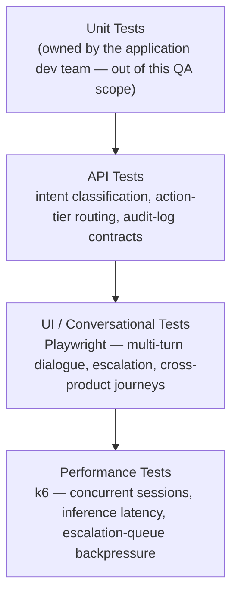
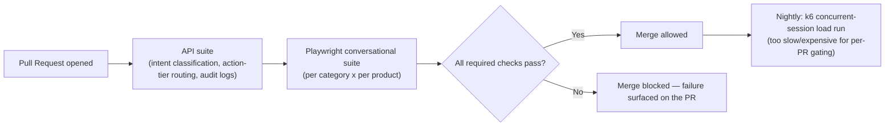

# AI Dispute Resolution Engine — Tech Stack & Skills Demonstrated

> Everything in this doc is answerable by reading this repo alone — no need to visit an external
> site to understand what was used or why. See [`business-overview.md`](./business-overview.md)
> for the product/module breakdown and [`architecture-and-flow.md`](./architecture-and-flow.md)
> for how the system actually behaves.

## 1. Full Tech Stack, and Why Each Tool

| Category | Tool | Why This Tool Specifically |
|---|---|---|
| **UI Automation** | Playwright + TypeScript | Drives the chat widget across all 6 connected products' embeddings consistently (see [`../automation/README.md`](../automation/README.md) for why assertions target intent/outcome state, not exact response text) |
| **API Testing & Automation** | Playwright API requests, Postman | Validates intent classification, action-tier routing, and audit-log entries directly against the contract, independent of the conversational UI's phrasing |
| **Performance Testing** | k6 | Concurrent-session and inference-latency load testing (section 5 below) — chosen to stay in the same JS ecosystem as Playwright |
| **CI/CD** | Jenkins / GitHub Actions | Automates the regression suite on a schedule/trigger — see section 4 for the suggested pipeline shape |
| **Bug Tracking & Traceability** | JIRA, RTM | Full defect lifecycle tracking plus requirement-to-test-coverage traceability — see [`../sample-rtm.md`](../sample-rtm.md) |
| **Version Control** | Git, GitHub | This repo itself; diagrams throughout are Mermaid, which GitHub renders natively with zero extra tooling |

## 2. Skills Demonstrated — Skill → Where to See It

| Skill | Demonstrated By | Where to Look |
|---|---|---|
| **Conversational AI / Chatbot Testing** | Intent recognition, response accuracy, fallback, context retention across all 6 categories | [`../regression-checklist.md`](../regression-checklist.md) sections 1–4 |
| **API Testing** | Action-tier routing and audit-log contract validation | [`../regression-checklist.md`](../regression-checklist.md) section 10 |
| **UI Automation** | Playwright spec covering the dispute-resolution conversational flow | [`../automation/sample-dispute-flow.spec.ts`](../automation/sample-dispute-flow.spec.ts) |
| **Cross-Product Consistency Testing** | The same category tested across all 6 originating products, not once in aggregate | [`../regression-checklist.md`](../regression-checklist.md) section 5 |
| **Performance Testing** | k6-based concurrent-session and inference-latency load testing | Section 5 below |
| **AI Security / Red-Teaming-Adjacent Testing** | Prompt-injection resistance and permission-boundary enforcement, mapped to OWASP's LLM Top 10 | [`../regression-checklist.md`](../regression-checklist.md) `TC-048`–`TC-050`; [`architecture-and-flow.md`](./architecture-and-flow.md) section 6 |
| **Anomaly Detection Testing** | Fraud-pattern injection and threshold-breach validation | [`../regression-checklist.md`](../regression-checklist.md) section 7 |
| **Requirement Traceability (RTM)** | A worked requirement → test case → status mapping | [`../sample-rtm.md`](../sample-rtm.md) |
| **Defect Management & Root-Cause Analysis** | Worked defects identifying the actual mechanism (a verification-proxy instead of a verification event; two confidence scores conflated into one) rather than just the symptom | [`../sample-defect-report.md`](../sample-defect-report.md) |
| **Test Reporting & Metrics** | A structured execution summary with pass/fail breakdown by area | [`../regression-execution-summary.md`](../regression-execution-summary.md) |
| **Technical Documentation & Communication** | This entire `docs/` set | This doc set, start to finish |

## 3. The Testing Pyramid Applied to This Project

## 4. CI/CD — Suggested Pipeline Shape

> **Note on scope, matching this repo's existing honesty convention** (see
> [`../automation/README.md`](../automation/README.md)): this repo includes one representative
> Playwright spec rather than the full framework, to stay focused as a portfolio piece. The
> pipeline below is the **suggested shape** that automation is designed to slot into, not a claim
> that a live CI instance with this exact pipeline is currently running against this repo.

## 5. Performance Testing, In Depth

Performance for a conversational AI engine isn't about transaction throughput — it's about
whether **response quality and latency hold up under concurrent load**, across all six connected
products simultaneously, since this engine is shared infrastructure for every one of them.

| Test Type | What It Targets | Why It Matters Here Specifically |
|---|---|---|
| **Concurrent-session load test** | Many simultaneous multi-turn conversations, across different originating products at once | This is the realistic shape of load for shared infrastructure — six products' support traffic landing on one engine means genuine concurrency is the normal case, not an edge case |
| **Inference-latency test** | P95/P99 response time per conversational turn, under load | A slow response in a chat interface is immediately, viscerally noticeable to a user in a way a slow background job isn't — this is this product's closest equivalent to this portfolio's other repos' "P99 latency" concerns |
| **Escalation-queue backpressure test** | A surge of low-confidence or mandatory-escalation tickets (e.g., many commission-adjustment requests) hitting the human-agent queue at once | The ~80% AI-resolution rate assumes the 20% that escalate can actually be absorbed — a surge that overwhelms the human queue defeats the whole point of fast resolution, even if the AI layer itself is fast |
| **Context-retention-under-load test** | Many concurrent multi-turn conversations, each needing its own context correctly isolated and retained | `TC-024`/`TC-025` test this for one conversation at a time — concurrent load is where context bleed between unrelated sessions would actually have a chance to surface |

**What this is deliberately not:** a claim that this engine needs to sustain payment-engine-style
transaction throughput. The realistic risk is response quality and latency degrading — or, worse,
context isolation breaking down — under the concurrent, multi-product conversational load this
shared-infrastructure design guarantees it will actually see.

## 6. Why This Doc Exists Separately From business-overview.md

[`business-overview.md`](./business-overview.md) answers *what* this module is and *why* its
risk model looks the way it does. This doc answers a different question — *how* that gets tested
and with what tools — so a reader scanning for technical/skill evidence doesn't have to filter it
out of the business-context narrative, and vice versa.
